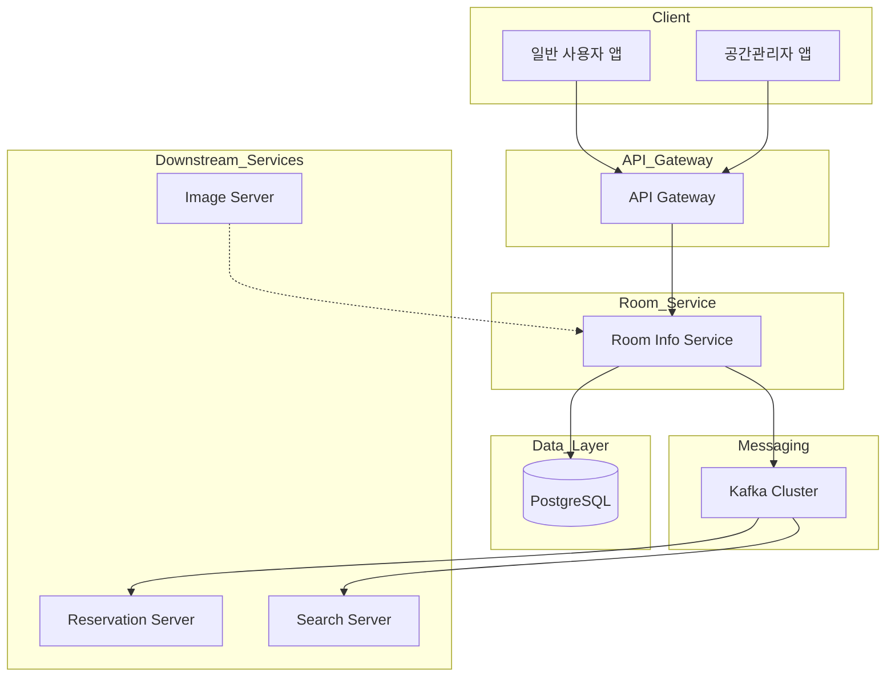

# Room-Info-Service 가이드 문서

## 1. 개요

### 1.1 목적

Room-Info-Service는 플랫폼 내 룸(공간) 정보 관리를 담당하는 마이크로서비스이다. 공간(Place) 내의 예약 가능한 룸 단위 정보를 CRUD하고, 예약 시스템과 연동하기 위한 이벤트를 발행한다.

### 1.2 주요 기능

| 기능         | 설명                                |
|------------|-----------------------------------|
| 룸 생성/수정/삭제 | 공간관리자 앱을 통한 룸 정보 CRUD             |
| 룸 상태 관리    | OPEN, CLOSE, PENDING 상태 전이 관리     |
| 룸 검색       | 키워드, 공간ID, 수용인원 등 조건별 검색          |
| 예약 필드 관리   | 룸별 커스텀 예약 입력 필드 관리                |
| 키워드 관리     | 룸에 연결된 옵션/태그 키워드 관리               |
| 이미지 관리     | 룸 이미지 등록 및 순서 관리 (최대 10개)         |
| 이벤트 발행     | room-created, room-deleted 이벤트 발행 |

### 1.3 기술 스택

| 구분             | 기술                        |
|----------------|---------------------------|
| Framework      | Spring Boot 3.5.7         |
| Language       | Java 17 (Eclipse Temurin) |
| Database       | PostgreSQL 15.x           |
| Message Broker | Apache Kafka              |
| Query          | QueryDSL 5.0              |
| Documentation  | Swagger/OpenAPI 3.0       |

---

## 2. 시스템 아키텍처

### 2.1 전체 구조



### 2.2 레이어 아키텍처 (CQRS)


### 2.3 룸 생성 흐름


### 2.4 룸 조회 흐름 (앱 타입별 분기)


---

## 3. 데이터 모델

### 3.1 ERD


### 3.2 테이블 상세

#### RoomInfo (룸 정보)

| 필드            | 타입           | 필수 | 설명                   |
|---------------|--------------|----|----------------------|
| room_id       | BIGINT       | Y  | Snowflake ID (PK)    |
| room_name     | VARCHAR(255) | Y  | 룸 이름                 |
| place_id      | BIGINT       | Y  | 소속 공간 ID             |
| status        | ENUM         | Y  | OPEN, CLOSE, PENDING |
| time_slot     | ENUM         | N  | HOUR, HALFHOUR       |
| max_occupancy | INT          | N  | 최대 수용 인원             |

#### RoomImage (룸 이미지)

| 필드        | 타입           | 필수 | 설명              |
|-----------|--------------|----|-----------------|
| image_id  | VARCHAR(100) | Y  | 이미지 고유 ID (PK)  |
| room_id   | BIGINT       | Y  | FK to RoomInfo  |
| image_url | VARCHAR(500) | Y  | 이미지 URL         |
| sequence  | BIGINT       | N  | 이미지 순서 (1부터 시작) |

#### Keyword (키워드/옵션)

| 필드         | 타입          | 필수 | 설명            |
|------------|-------------|----|---------------|
| keyword_id | BIGINT      | Y  | 자동 증가 PK      |
| keyword    | VARCHAR(50) | Y  | 키워드명 (UNIQUE) |

#### RoomOptionsMapper (룸-키워드 매핑)

| 필드         | 타입     | 필수 | 설명                 |
|------------|--------|----|--------------------|
| room_id    | BIGINT | Y  | PK, FK to RoomInfo |
| keyword_id | BIGINT | Y  | PK, FK to Keyword  |

#### ReservationField (예약 커스텀 필드)

| 필드         | 타입           | 필수 | 설명                   |
|------------|--------------|----|----------------------|
| field_id   | BIGINT       | Y  | 자동 증가 PK             |
| room_id    | BIGINT       | Y  | FK to RoomInfo       |
| title      | VARCHAR(100) | Y  | 필드 제목                |
| input_type | ENUM         | Y  | TEXT, NUMBER, SELECT |
| required   | BOOLEAN      | Y  | 필수 입력 여부 (기본: false) |
| max_length | INT          | N  | 최대 입력 길이 (기본: 500)   |
| sequence   | INT          | Y  | 필드 표시 순서             |

#### FurtherDetail / CautionDetail (추가정보 / 주의사항)

| 필드        | 타입           | 필수 | 설명             |
|-----------|--------------|----|----------------|
| detail_id | BIGINT       | Y  | 자동 증가 PK       |
| room_id   | BIGINT       | Y  | FK to RoomInfo |
| content   | VARCHAR(255) | Y  | 상세 내용          |

---

## 4. API 명세

### 4.1 공통 헤더

| 헤더         | 필수 | 설명                          |
|------------|----|-----------------------------|
| X-App-Type | 조건 | GENERAL (기본), PLACE_MANAGER |
| X-User-Id  | N  | 요청 사용자 ID                   |

### 4.2 룸 명령 (Command)

#### 룸 생성

```
POST /api/rooms
```

**Headers**

| 헤더         | 필수 | 설명                |
|------------|----|-------------------|
| X-App-Type | Y  | PLACE_MANAGER만 허용 |

**Request**

```json
{
  "roomName": "스터디룸 A",
  "placeId": 1234567890,
  "timeSlot": "HOUR",
  "maxOccupancy": 10,
  "furtherDetails": [
    "프로젝터 사용 가능",
    "화이트보드 제공"
  ],
  "cautionDetails": [
    "음식물 반입 금지"
  ],
  "keywordIds": [
    1,
    2,
    3
  ]
}
```

**Response**

```json
1234567890123456789
```

**상태 코드**

| 코드  | 설명               |
|-----|------------------|
| 201 | 생성 성공            |
| 400 | 잘못된 요청 (헤더 누락 등) |
| 403 | PLACE_MANAGER 아님 |

#### 룸 수정

```
PUT /api/rooms/{roomId}
```

**Request**

```json
{
  "roomName": "스터디룸 A (리뉴얼)",
  "timeSlot": "HALFHOUR",
  "maxOccupancy": 8,
  "furtherDetails": [
    "프로젝터 사용 가능"
  ],
  "cautionDetails": [
    "음식물 반입 금지",
    "소음 자제"
  ],
  "keywordIds": [
    1,
    2
  ]
}
```

**Response**

```json
1234567890123456789
```

#### 룸 상태 변경

```
PATCH /api/rooms/{roomId}/status?status=CLOSE
```

**Query Parameters**

| 파라미터   | 타입   | 필수 | 설명                   |
|--------|------|----|----------------------|
| status | Enum | Y  | OPEN, CLOSE, PENDING |

#### PENDING 룸 종료

```
PATCH /api/rooms/{roomId}/close
```

**설명**

- PENDING 상태의 룸만 CLOSE로 변경 가능
- X-App-Type 헤더 선택적 (GENERAL도 허용)

#### 룸 삭제

```
DELETE /api/rooms/{roomId}
```

**상태 코드**

| 코드  | 설명               |
|-----|------------------|
| 200 | 삭제 성공            |
| 403 | PLACE_MANAGER 아님 |
| 404 | 룸을 찾을 수 없음       |

### 4.3 룸 조회 (Query)

#### 룸 상세 조회

```
GET /api/rooms/{roomId}
```

**Response**

```json
{
  "roomId": "1234567890123456789",
  "roomName": "스터디룸 A",
  "placeId": "9876543210",
  "status": "OPEN",
  "timeSlot": "HOUR",
  "maxOccupancy": 10,
  "furtherDetails": [
    "프로젝터 사용 가능",
    "화이트보드 제공"
  ],
  "cautionDetails": [
    "음식물 반입 금지"
  ],
  "keywords": [
    {
      "keywordId": 1,
      "keyword": "프로젝터"
    },
    {
      "keywordId": 2,
      "keyword": "화이트보드"
    }
  ],
  "images": [
    {
      "imageId": "img-001",
      "imageUrl": "https://...",
      "sequence": 1
    },
    {
      "imageId": "img-002",
      "imageUrl": "https://...",
      "sequence": 2
    }
  ],
  "reservationFields": [
    {
      "fieldId": 1,
      "title": "이용 목적",
      "inputType": "TEXT",
      "required": true,
      "maxLength": 200,
      "sequence": 1
    }
  ]
}
```

**앱 타입별 동작**

| X-App-Type    | 동작                     |
|---------------|------------------------|
| GENERAL (기본)  | Status가 OPEN인 룸만 조회 가능 |
| PLACE_MANAGER | 모든 Status의 룸 조회 가능     |

#### 룸 검색

```
GET /api/rooms/search
```

**Query Parameters**

| 파라미터         | 타입         | 필수 | 설명           |
|--------------|------------|----|--------------|
| roomName     | String     | N  | 룸 이름 (부분 일치) |
| keywordIds   | List<Long> | N  | 키워드 ID 목록    |
| placeId      | Long       | N  | 공간 ID        |
| minOccupancy | Int        | N  | 최소 수용 인원     |

**Response**

```json
[
  {
    "roomId": "1234567890123456789",
    "roomName": "스터디룸 A",
    "placeId": "9876543210",
    "status": "OPEN",
    "maxOccupancy": 10,
    "thumbnailUrl": "https://..."
  }
]
```

#### 공간별 룸 목록

```
GET /api/rooms/place/{placeId}
```

#### 룸 일괄 조회

```
GET /api/rooms/batch?ids=1,2,3
```

#### 키워드 목록 조회

```
GET /api/rooms/keywords
```

**Response**

```json
{
  "1": {
    "keywordId": 1,
    "keyword": "프로젝터"
  },
  "2": {
    "keywordId": 2,
    "keyword": "화이트보드"
  },
  "3": {
    "keywordId": 3,
    "keyword": "와이파이"
  }
}
```

### 4.4 예약 필드 관리

#### 예약 필드 목록 조회

```
GET /api/rooms/{roomId}/reservation-fields
```

**Response**

```json
[
  {
    "fieldId": 1,
    "title": "이용 목적",
    "inputType": "TEXT",
    "required": true,
    "maxLength": 200,
    "sequence": 1
  },
  {
    "fieldId": 2,
    "title": "참석 인원",
    "inputType": "NUMBER",
    "required": true,
    "maxLength": null,
    "sequence": 2
  }
]
```

#### 예약 필드 추가

```
POST /api/rooms/{roomId}/reservation-fields
```

**Request**

```json
{
  "title": "이용 목적",
  "inputType": "TEXT",
  "required": true,
  "maxLength": 200,
  "sequence": 1
}
```

#### 예약 필드 전체 교체

```
PUT /api/rooms/{roomId}/reservation-fields
```

**Request**

```json
[
  {
    "title": "이용 목적",
    "inputType": "TEXT",
    "required": true,
    "maxLength": 200,
    "sequence": 1
  },
  {
    "title": "참석 인원",
    "inputType": "NUMBER",
    "required": true,
    "sequence": 2
  }
]
```

#### 예약 필드 삭제

```
DELETE /api/rooms/{roomId}/reservation-fields/{fieldId}
```

---

## 5. 이벤트 명세

### 5.1 Kafka Topics

| Topic        | Producer         | Consumer           | 설명              |
|--------------|------------------|--------------------|-----------------|
| room-created | Room Info Server | Reservation Server | 룸 생성, 슬롯 생성 트리거 |
| room-deleted | Room Info Server | Reservation Server | 룸 삭제, 슬롯 삭제 트리거 |
| room-images  | Image Server     | Room Info Server   | 이미지 업로드 완료 이벤트  |

### 5.2 이벤트 페이로드

#### room-created

```json
{
  "topic": "room-created",
  "roomId": "1234567890123456789",
  "placeId": "9876543210",
  "timeSlot": "HOUR"
}
```

**설명**

- roomId, placeId는 JavaScript Number 정밀도 손실 방지를 위해 String으로 변환하여 전송

#### room-deleted

```json
{
  "topic": "room-deleted",
  "roomId": "1234567890123456789"
}
```

---

## 6. 비즈니스 규칙

### 6.1 룸 상태 전이


### 6.2 앱 타입별 권한

| 기능           | GENERAL | PLACE_MANAGER |
|--------------|---------|---------------|
| 룸 생성         | X       | O             |
| 룸 수정         | X       | O             |
| 룸 삭제         | X       | O             |
| 룸 상태 변경      | X       | O             |
| PENDING 룸 종료 | O       | O             |
| OPEN 룸 조회    | O       | O             |
| 모든 상태 룸 조회   | X       | O             |
| 예약 필드 관리     | X       | O             |

### 6.3 데이터 제약 조건

| 항목       | 제약          |
|----------|-------------|
| 룸 이미지    | 최대 10개      |
| 예약 필드    | 최대 10개      |
| 추가 정보    | 항목당 최대 255자 |
| 주의 사항    | 항목당 최대 255자 |
| 필드 제목    | 최대 100자     |
| 최대 수용 인원 | 1명 이상       |

### 6.4 키워드 관리

- 키워드는 시스템 초기화 시 미리 정의된 목록으로 관리
- 룸 생성/수정 시 존재하는 키워드 ID만 연결 가능
- 존재하지 않는 키워드 ID 사용 시 `IllegalArgumentException` 발생

---

## 7. 환경 설정

### 7.1 환경 변수

```bash
# Database
SPRING_DATASOURCE_URL=jdbc:postgresql://localhost:5432/roomdb
SPRING_DATASOURCE_USERNAME=roomuser
SPRING_DATASOURCE_PASSWORD=your_password

# Kafka
SPRING_KAFKA_BOOTSTRAP_SERVERS=localhost:9092
SPRING_KAFKA_CONSUMER_GROUP_ID=room-consumer-group

# Spring Profile
SPRING_PROFILES_ACTIVE=dev

# JVM Options (컨테이너 환경)
JAVA_OPTS=-Xms512m -Xmx1024m
```

### 7.2 Docker 배포

#### Dockerfile

```dockerfile
# Multi-stage build for Spring Boot application
FROM gradle:8.14.3-jdk17 AS builder
WORKDIR /app
COPY . .
RUN chmod +x gradlew && ./gradlew build -x test --no-daemon

FROM eclipse-temurin:17-jre
WORKDIR /app
RUN apt-get update && apt-get install -y curl && rm -rf /var/lib/apt/lists/*
COPY --from=builder /app/build/libs/*.jar app.jar
EXPOSE 8080
ENV JAVA_OPTS="-XX:MaxRAMPercentage=75.0 -XX:+UseContainerSupport"
ENTRYPOINT ["sh", "-c", "java $JAVA_OPTS -jar app.jar"]
```

### 7.3 Docker Compose

```yaml
version: '3.8'

services:
  room-info-service:
    image: ddingsh9/roominfoserver:latest
    container_name: room-info-service
    ports:
      - "8080:8080"
    environment:
      - SPRING_PROFILES_ACTIVE=docker
      - SPRING_DATASOURCE_URL=jdbc:postgresql://postgres:5432/roomdb
      - SPRING_DATASOURCE_USERNAME=roomuser
      - SPRING_DATASOURCE_PASSWORD=roompass
      - SPRING_KAFKA_BOOTSTRAP_SERVERS=kafka:9092
    depends_on:
      - postgres
      - kafka

  postgres:
    image: postgres:15-alpine
    environment:
      - POSTGRES_DB=roomdb
      - POSTGRES_USER=roomuser
      - POSTGRES_PASSWORD=roompass
    ports:
      - "5432:5432"
    volumes:
      - postgres-data:/var/lib/postgresql/data

  kafka:
    image: confluentinc/cp-kafka:7.5.0
    depends_on:
      - zookeeper
    ports:
      - "9092:9092"
    environment:
      KAFKA_BROKER_ID: 1
      KAFKA_ZOOKEEPER_CONNECT: 'zookeeper:2181'
      KAFKA_LISTENER_SECURITY_PROTOCOL_MAP: PLAINTEXT:PLAINTEXT,PLAINTEXT_HOST:PLAINTEXT
      KAFKA_ADVERTISED_LISTENERS: PLAINTEXT://kafka:29092,PLAINTEXT_HOST://localhost:9092

  zookeeper:
    image: confluentinc/cp-zookeeper:7.5.0
    ports:
      - "2181:2181"
    environment:
      ZOOKEEPER_CLIENT_PORT: 2181

volumes:
  postgres-data:
```

---

## 8. 에러 코드

### 8.1 요청 에러

| 코드                    | HTTP Status | 설명        |
|-----------------------|-------------|-----------|
| HEADER_MISSING        | 400         | 필수 헤더 누락  |
| INVALID_HEADER_FORMAT | 400         | 헤더 형식 오류  |
| INVALID_REQUEST       | 400         | 잘못된 요청 본문 |

### 8.2 권한 에러

| 코드                      | HTTP Status | 설명            |
|-------------------------|-------------|---------------|
| PLACE_MANAGER_ONLY      | 403         | 공간관리자 앱 전용 기능 |
| UNAUTHORIZED_APP_ACCESS | 403         | 앱 접근 권한 없음    |

### 8.3 리소스 에러

| 코드                | HTTP Status | 설명             |
|-------------------|-------------|----------------|
| ROOM_NOT_FOUND    | 404         | 룸을 찾을 수 없음     |
| KEYWORD_NOT_FOUND | 400         | 키워드를 찾을 수 없음   |
| FIELD_NOT_FOUND   | 404         | 예약 필드를 찾을 수 없음 |

### 8.4 비즈니스 에러

| 코드                        | HTTP Status | 설명                   |
|---------------------------|-------------|----------------------|
| MAX_IMAGES_EXCEEDED       | 400         | 이미지 최대 개수 초과 (10개)   |
| MAX_FIELDS_EXCEEDED       | 400         | 예약 필드 최대 개수 초과 (10개) |
| INVALID_STATUS_TRANSITION | 400         | 유효하지 않은 상태 전이        |
| INVALID_OCCUPANCY         | 400         | 수용 인원은 1명 이상이어야 함    |

---

## 9. 구현 우선순위

### Phase 1 - 핵심 기능 (완료)

- [x] 룸 CRUD API
- [x] 룸 상태 관리
- [x] 키워드 연결
- [x] 추가정보/주의사항 관리
- [x] Kafka 이벤트 발행

### Phase 2 - 검색 및 조회 (완료)

- [x] QueryDSL 기반 동적 검색
- [x] 앱 타입별 조회 필터링
- [x] 일괄 조회 API

### Phase 3 - 예약 필드 (완료)

- [x] 예약 커스텀 필드 CRUD
- [x] 필드 타입별 검증

### Phase 4 - 고도화 (진행 중)

- [ ] 이미지 서버 연동
- [ ] Redis 캐싱
- [ ] API Gateway 연동
- [ ] Prometheus + Grafana 모니터링

---

## 10. 참고 사항

### 10.1 Snowflake ID 생성

Room Info Server는 분산 환경에서 고유 ID를 생성하기 위해 Snowflake 알고리즘을 사용한다.

```
|-- 1 bit --|-- 41 bits --|-- 10 bits --|-- 12 bits --|
|   sign    |  timestamp  |  machine id | sequence    |
```

- **64-bit 고유 ID**: 충돌 없는 분산 ID 생성
- **시간순 정렬**: timestamp 기반으로 자연 정렬 가능
- **JavaScript 호환**: String으로 변환하여 Number 정밀도 손실 방지

### 10.2 X-App-Type 기반 접근 제어


### 10.3 이미지 처리

- 이미지 업로드는 별도 Image Server에서 처리
- Room Info Server는 `room-images` 토픽을 통해 이미지 정보 수신
- imageId + imageUrl 쌍으로 관리하여 CDN 연동 지원

---

**버전**: 0.0.1-SNAPSHOT
**최종 업데이트**: 2025-01-20
**팀**: TeamBind Development Team
